# Introduction/Background

The objective of this project is to create a Machine Learning model that can predict the potential salary of a job position based on details provided within a LinkedIn job posting. The chosen dataset to be used for training contains around 15,000 LinkedIn posts collected in a period of two days. From those posts, information was extracted and organized in CSV format with 27 different features such as location, company name, number of applications, etc.  

There have been past efforts to build a model to predict salary from job posts using various ML methods. One of them is using a bidirectional-GRU-CNN model suggested by Wang, et al, which has been proved to have a higher accuracy than other traditional models [1]. Another effort focused on creating a regression model to predict stock prices using large language models (LLMs), utilizing textual information [2]. Various statistical ML methods have been utilized for salary predictions around the world [3]. Our dataset can be found [here](https://www.kaggle.com/datasets/arshkon/linkedin-job-postings)

# Problem Definition

LinkedIn, a leading job platform, offers extensive information about companies and job openings. However, many companies do not disclose salary details in their postings. This omission can lead to frustration for potential applicants, as they lack crucial information for decision-making. Access to salary data can streamline the application process, allowing candidates to make well-informed choices and develop effective negotiation strategies.

# Methods

For our data preprocessing and analysis, we will employ a set of common Python libraries and packages to efficiently handle various tasks. These include NumPy, pandas, scikit-learn, and NLTK. These packages are specifically utilized for data science, ML, and NLP tasks.

For the supervised learning task, our overall goal was to fine-tune BERT, a pre-trained transformer (a type of deep learning architecture) model, using textual data from Linkedin job postings. Specifically, we would utilize the job descriptions for each posting. We aimed to train a regression model on these to estimate salaries.

## Salary Preprocessing

Our initial step involved preprocessing the dataset, employing several techniques to clean it. The original dataset comprised 15,866 job listing entries with 27 metadata columns. We began by removing entries lacking associated salary data, resulting in a dataset reduction to 6,502 entries. Given our focus on training the data for a regression task, it was imperative to ensure labeled data, requiring a corresponding salary for each job listing. Addressing variations in salary presentation, some featuring minimum and maximum values while others solely a median, we standardized the representation. All salaries initially expressed as ranges were converted to singular median values. This simplification aimed to reduce the overall complexity by assigning each job listing a unique and representative salary value. Moreover, we encountered inconsistencies in formatting, ranging from hourly wages to monthly rates and annual salaries. To ensure uniformity, we converted all entries to annualized salaries, assuming a reasonable translation from hourly and monthly rates. This adjustment aimed to establish a consistent format for representing the salary of each job posting.

To visually represent the refined dataset’s salary distribution, the following histogram offers insights into the spread of salary data within our analysis.
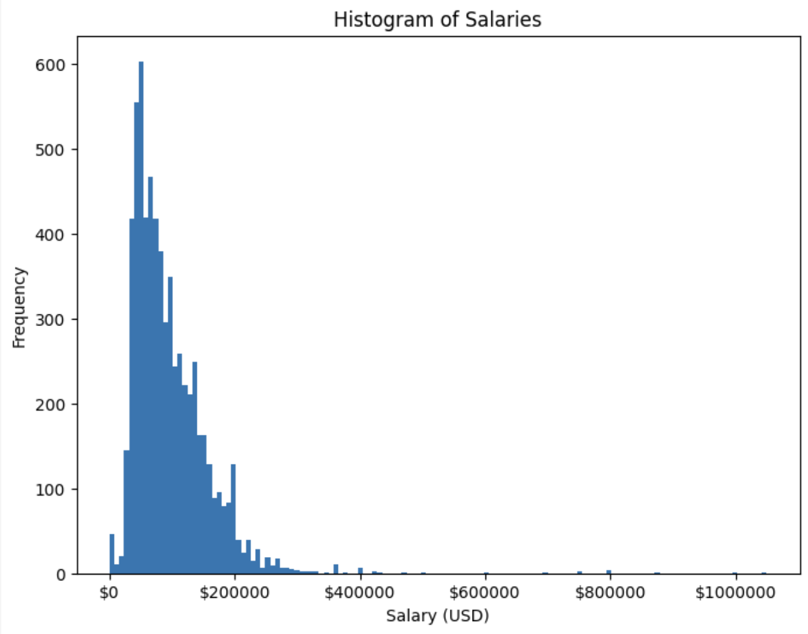

## Text Preprocessing

In processing the text data, we performed preliminary preprocessing for the job descriptions. Initially, undesired characters, such as newline characters, were removed from the text. This step aimed to furnish a more refined text input, ensuring an optimal input for the model. Next, it was found that certain job descriptions contained salary information within the text. Including such information in the input data would defeat the purpose of creating a model for it. To maintain clarity and objectivity in our data, we utilized regular expressions to remove salary details from the text. The following histogram illustrates the word count distribution across all job postings in our processed dataset.

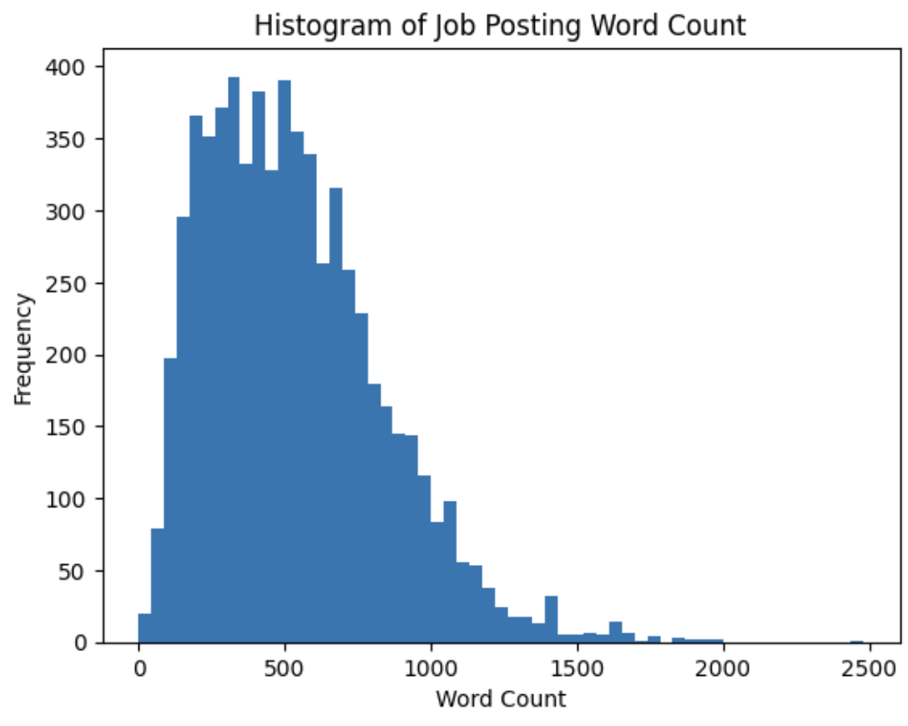

At this point, the data preprocessing techniques diverge between two models that we wanted to compare. The first model underwent no additional preprocessing beyond this point. In contrast, the second model aimed to explore the impacts of additional NLP-related preprocessing, encompassing the conversion to lowercase, removal of punctuation, elimination of stopwords, and the application of stemming – reducing words to their stems. The selected stemmer for this process was the PorterStemmer. The underlying rationale was to potentially simplify the input for the model by representing words with shared stems as equivalent. However, it is important to note that leveraging BERT mitigates the need for such NLP-related preprocessing. BERT has the capability to learn from word embeddings and comprehend the contextual nuances that influence data output. In this comparative analysis, we created two models, differing only in this specific preprocessing step. Everything preceding and following this step remained constant.

## Feature Engineering

Following data preprocessing, the subsequent step involved feature engineering. This encompassed the generation of pre-trained BERT embeddings, which would then serve as inputs for the BERT model. To tokenize the text input, we utilized a pretrained BERT tokenizer from the Hugging Face library. This tokenizer exhibited specific features, such as assigning tokens for the beginning and ending of sentences. An important characteristic of this process is the maximum sequence length of 512 tokens (words) for each entry into the model. Consequently, any job descriptions with a word count below 512 were padded to ensure a uniform input throughout the entire dataset. Any descriptions with more than 512 words were truncated.

The input data was divided into training and testing datasets. Starting with the creation of BERT embeddings, all subsequent steps were executed on both the training and testing datasets. Following this, a data loader was created to facilitate input into the model. Simultaneously, an optimizer was configured. The current choice for the loss function was the mean square error (MSE), but this selection will be subject to experimentation in future testing to determine if a more optimal metric exists. The model was then trained for a regression task, specifically estimating salaries from job listings. The training process was expedited through the utilization of the GPU on Google Colab. The BERT pre-trained model from the Hugging Face library was employed, as well as PyTorch for the training process. The training loop was iterated for 3 epochs. It was a deliberate decision to limit the number of epochs, recognizing the tendency for overfitting in transformer-based models when subjected to an excessive number of epochs.

# Results & Discussions

Model 1 did not contain additional NLP text preprocessing, while Model 2 had this preprocessing applied to its dataset. To assess the accuracy of our predictions, we utilized mean squared error (MSE) and the R2 score as metrics (values tabulated below). As an AI article from Medium states, “R-Squared describes how well a model fits for a linear regression model. The higher R, the better the fit” [4]. Since regression is the exact purpose of these models and it is important to quantify goodness of fit, R2 score was a great choice for this use-case. The article also mentions that the MSE calculation involves “distance between the actual point and the predicted point” [4] which also helps to quantify the prediction performance of these regression models. In addition, the mean and median absolute errors were measured. This provided a dollar amount of how off the predictions were compared to their true values.

The two models were tested across 5 learning rates: 1e-6, 5e-6, 1e-5, 5e-5, and 1e-4. We chose to use the AdamW for its state of the part performance and various heuristics it uses for better first order updates. Once the training was complete, the model’s performance was measured on the test set. We created scatter plots to display the predictions of each model compared to the true values, where were sorted in increasing order. These plots for each learning rate and model can be found in the Appendix.

Looking into the performance of the first model, the highest R2 value was achieved using a learning rate of 5e-6, resulting in approximately 0.642. This run also had the lowest MSE. But, using a learning rate of 5e-5 resulted in lower mean and median absolute values, approximately $24,000 and $14,000 respectively. Besides the learning rate, the random seed used can have a drastic impact on fine-tuning performance. It is interesting to see that there is not a single specific set of hyperparameters that optimizes all metrics for model 1. This means that we need to utilize different models if we want to optimize performance for different specific metrics.

For the second model, the highest R2 value was achieved using a learning rate of 1e-5, resulting in approximately 0.654. This run also had the lowest MSE value, mean absolute error (~\\\$23700), and median absolute error (~\\\$17000). Figure

Comparing between models 1 and 2, model 2 performs slightly better with a higher R2 score and lower MSE value. There is not a considerable difference, though. Because model 2 required extra text preprocessing for very minimal improvement in performance, this experiment shows that this might not be worth the extra computational resources needed to do that extra preprocessing. Although this preprocessing can reduce the complexity of the data, some of the nuance that can be present in complete sentences will be lost. This nuance and contextualization can be captured by BERT, which is one of its highlights as a transformer-based model [5]. So, this could potentially be a limitation for model 2.  

Looking at the visualizations, we can see that some of the models seem to have a straight horizontal line through the middle. These only occur at certain learning rates for both models. Upon inspection of the metrics, it can be seen that these specific models have negative R2 scores, and the other metrics reflect similar diminished performances. This shows that the model has failed to converge properly when trained using those learning rates. These learning rates were on the higher end of the different learning rates tested, which means those serve as upper bounds as to what learning rates can be used to train these models.

Next steps would include continued testing beyond the hyperparameters tested here. Due to time constraints, we were not able to explore and test everything that we wanted to. We could test other learning rates, introduce learning rate schedulers (i.e. Exponential LR), vary the number of epochs, vary the batch size, and look into other kinds of loss functions, such as L1 loss. In addition, the actual split between training and test data could be explored. For our project, we did a standard 80/20 split between training and testing, there are other combinations of these that could increase the different metrics. As it goes with any deep learning project, the more data that we can use for training, the better our model will perform. Since the Kaggle dataset we utilized seems to be updated on a regular basis with more job listings, an updated dataset could easily be replaced with our current dataset to test and improve our model so that it would be able to better predict the expected salary of a LinkedIn job posting.

# Tables

## Model 1 (No Additional Preprocessing) Tuning: Varying Learning Rate

| Learning Rate | Epochs | MSE           | R2     | Mean Absolute Error ($) | Median Absolute Error ($) |
|---------------|--------|---------------|--------|-------------------------|---------------------------|
| 1e-6          | 3      | 1856397602.94 | 0.4508 | 31219.01                | 23715.16                  |
| 5e-6          | 3      | 1210854155.33 | 0.6418 | 24347.40                | 19120.54                  |
| 1e-5          | 3      | 1446421634.99 | 0.5721 | 26900.67                | 18875.89                  |
| 5e-5          | 3      | 1233879316.12 | 0.6350 | 23996.84                | 14052.18                  |
| 1e-4          | 3      | 3449090128.33 | -0.0203| 45840.18                | 41029.77                  |

## Model 2 (Additional Preprocessing) Tuning: Varying Learning Rate

| Learning Rate | Epochs | MSE ($)       | R2     | Mean Absolute Error ($) | Median Absolute Error ($) |
|---------------|--------|---------------|--------|-------------------------|---------------------------|
| 1e-6          | 3      | 2076148594.95 | 0.4055 | 34694.81                | 28746.05                  |
| 5e-6          | 3      | 1743682927.79 | 0.5007 | 27525.10                | 18507.96                  |
| 1e-5          | 3      | 1207458796.61 | 0.6542 | 23651.37                | 16902.17                  |
| 5e-5          | 3      | 3708377178.32 | -0.0618| 43940.16                | 34893.40                  |
| 1e-4          | 3      | 3506859822.96 | -0.0041| 44227.41                | 38416.00                  |

## Optimal Models

| Model   | MSE Value     | R2 Value |
|---------|---------------|----------|
| Model 1 | 1210854155.33 | 0.6418   |
| Model 2 | 1207458796.61 | 0.6542   |

# Proposed Timeline

A link to our proposed timeline can be found [here](https://gtvault-my.sharepoint.com/:x:/g/personal/achennak3_gatech_edu/EZ1I5nr8EHFFreTAaKHqq60BgQprp8ddwrU7rgxkhf2eEA?e=9goeF5)

# Contribution Table

| Team Member | Contributions                                                                                            |
|-------------|----------------------------------------------------------------------------------------------------------|
| Akul        | Data preprocessing, report analysis/results section, model building, methods, testing, creating slides, recording, video editing  |
| Alex        | Report analysis/results section, results visualization, Gantt Chart, testing, creating slides, recording |
| Ayush       | Report analysis/results section, GitHub page management, model building, recording                       |
| Bao         | Report analysis/results section, R2 metric research, metrics analysis, introduction, creating slides     |
| Nikhil      | Researching metrics, R2 metric research, Report analysis/results section, creating slides, recording     |

# References

[1] Z. Wang, S. Sugaya, and D. P. T. Nguyen, “[PDF] Salary Prediction using Bidirectional-GRU-CNN Model,” Association for Natural Language Processing, Mar. 2019.

[2] P. Sonkiya, V. Bajpai, and A. Bansal, “Stock price prediction using BERT and GAN,” arXiv.org, Jul. 18, 2021. https://arxiv.org/abs/2107.09055 (accessed Oct. 06, 2023).

[3] Y. T. Matbouli and S. M. Alghamdi, “Statistical Machine Learning Regression Models for Salary Prediction Featuring Economy Wide Activities and Occupations,” Information, vol. 13, no. 10, p. 495, Oct. 2022, doi: 10.3390/info13100495.

[4] X. Geerinck, “Artificial Intelligence — How to measure performance — Accuracy, Precision, Recall, F1, ROC, RMSE, F-Test and R-Squared,” Medium, Jan. 03, 2020. Accessed: Oct. 06, 2023. [Online]. Available: https://medium.com/@xaviergeerinck/artificial-intelligence-how-to-measure-performance-accuracy-precision-recall-f1-roc-rmse-611d10e4caac

[5] https://arxiv.org/abs/1810.04805

# Appendix

## Model 1 (No Additional Preprocessing) Results

### Figure 1: Model 1 Results with 1e-6 Learning Rate

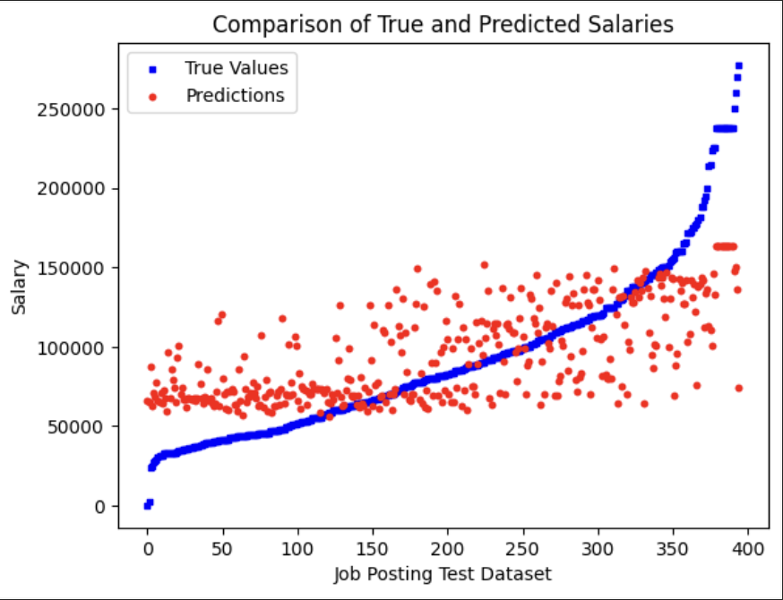

### Figure 2: Model 1 Results with 5e-6 Learning Rate

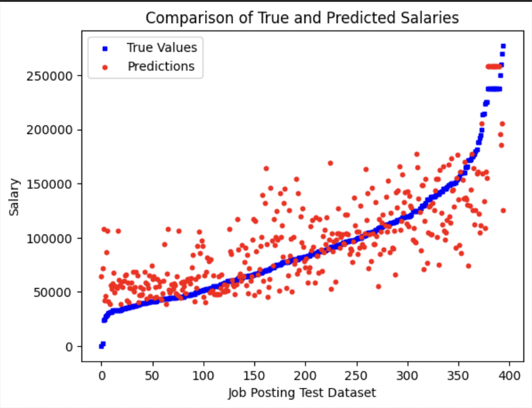

### Figure 3: Model 1 Results with 1e-5 Learning Rate

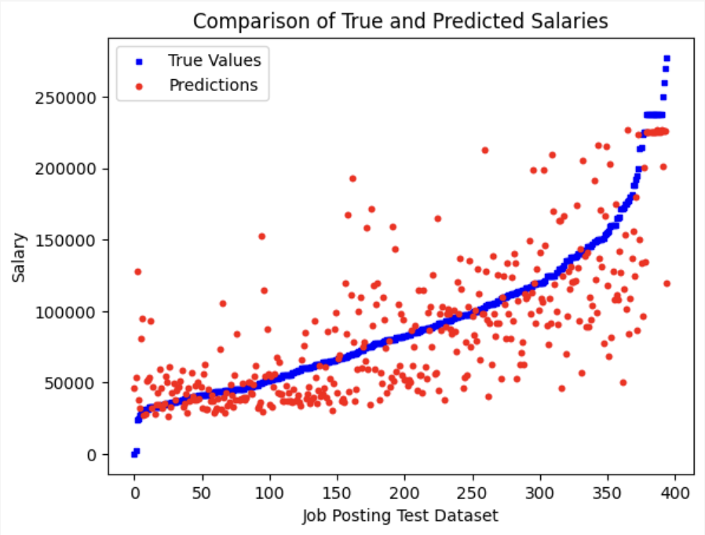

### Figure 4: Model 1 Results with 5e-5 Learning Rate

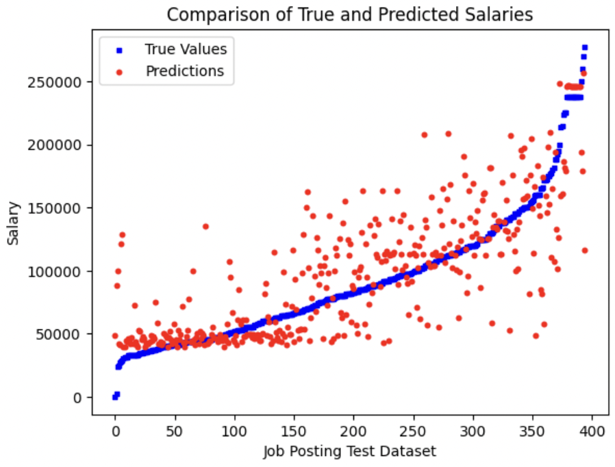

### Figure 5: Model 1 Results with 1e-4 Learning Rate

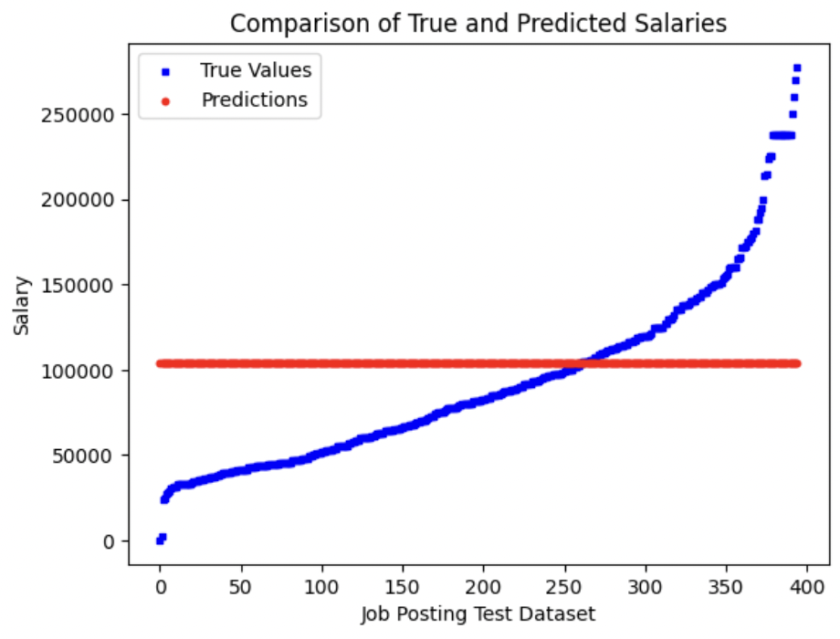

## Model 2 (Additional Preprocessing) Results

### Figure 6: Model 2 Results with 1e-6 Learning Rate

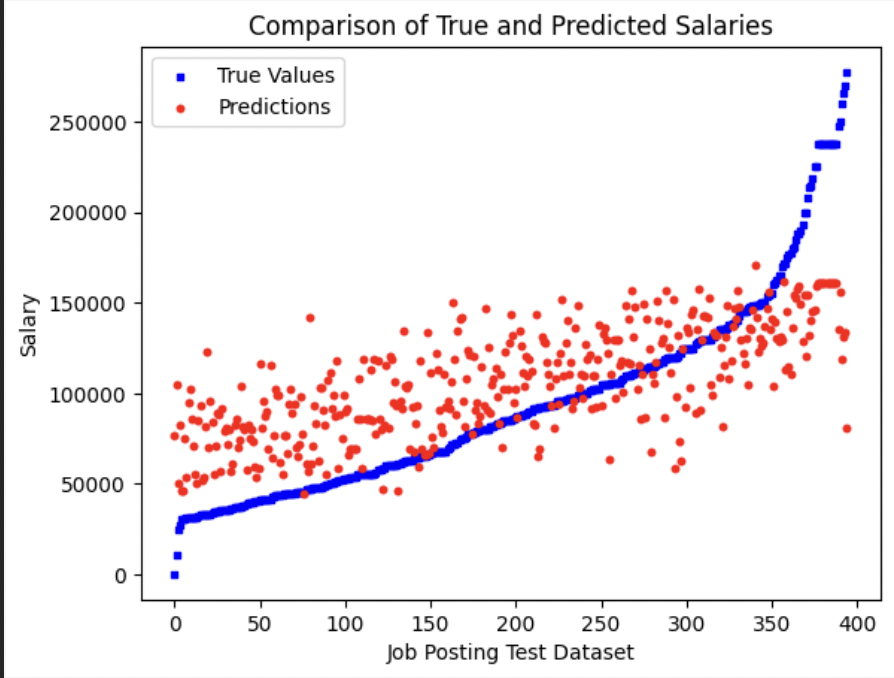

### Figure 7: Model 2 Results with 5e-6 Learning Rate

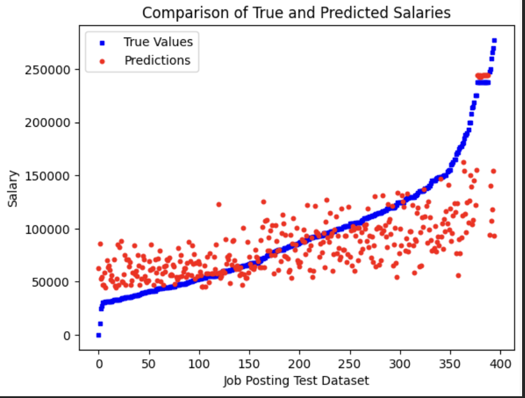

### Figure 8: Model 2 Results with 1e-5 Learning Rate

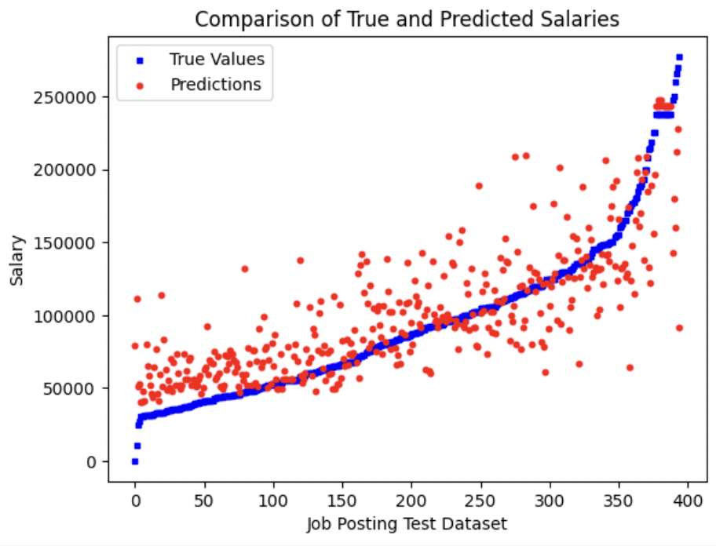

### Figure 9: Model 2 Results with 5e-5 Learning Rate

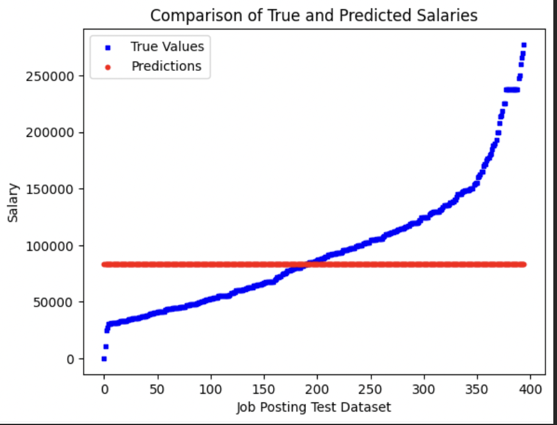

### Figure 10: Model 2 Results with 1e-4 Learning Rate

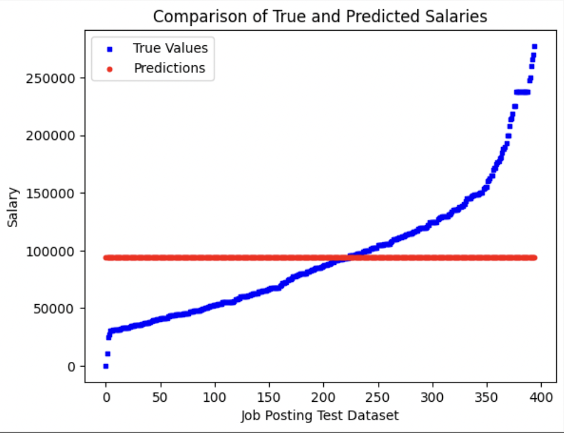

### Figure 11: Model 2 Absolute Error Visualization

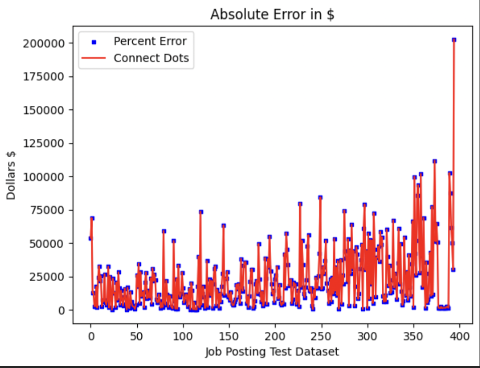