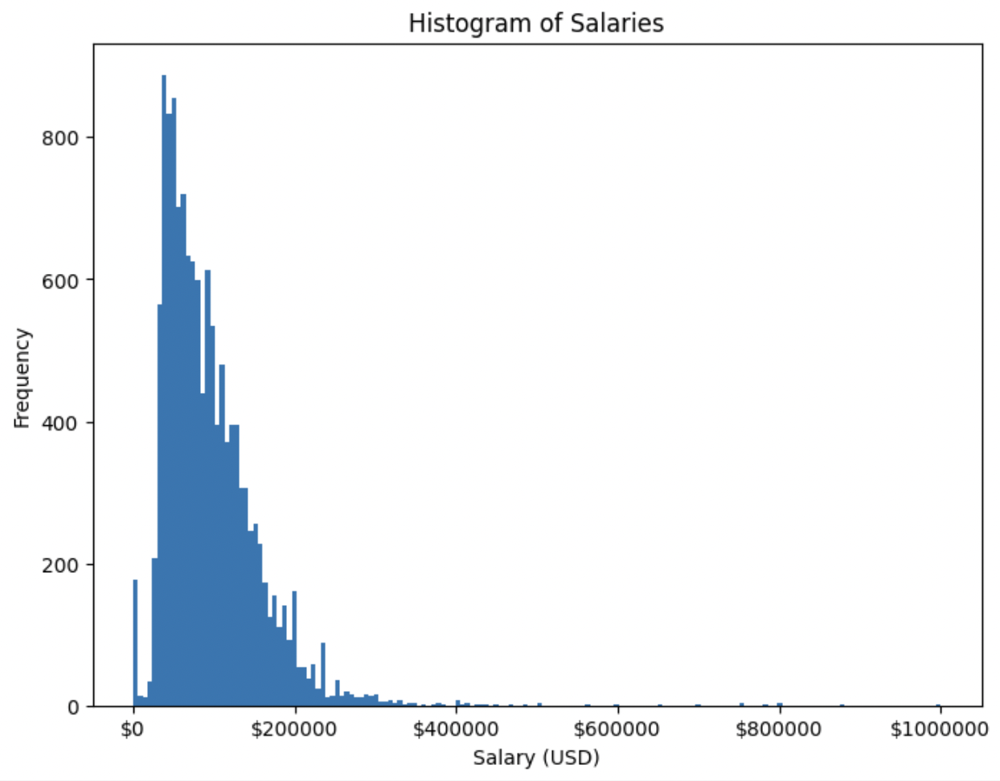
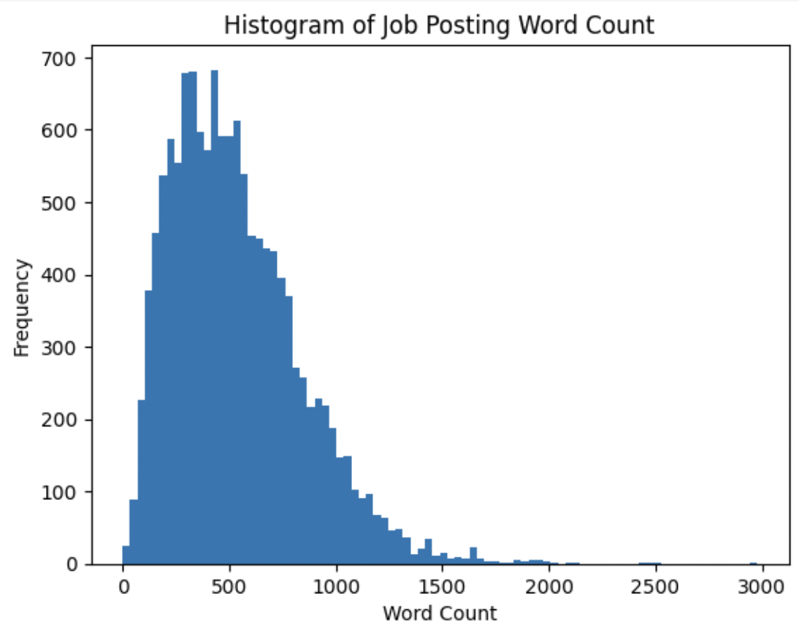

# Introduction/Background

The objective of this project is to create a Machine Learning model that can predict the potential salary of a job position based on details provided within a LinkedIn job posting. The chosen dataset to be used for training contains around 15,000 LinkedIn posts collected in a period of two days. From those posts, information was extracted and organized in CSV format with 27 different features such as location, company name, number of applications, etc.  

There have been past efforts to build a model to predict salary from job posts using various ML methods. One of them is using a bidirectional-GRU-CNN model suggested by Wang, et al, which has been proved to have a higher accuracy than other traditional models [1]. Another effort focused on creating a regression model to predict stock prices using large language models (LLMs), utilizing textual information [2]. Various statistical ML methods have been utilized for salary predictions around the world [3]. Our dataset can be found [here](https://www.kaggle.com/datasets/arshkon/linkedin-job-postings)

# Problem Definition

LinkedIn, a leading job platform, offers extensive information about companies and job openings. However, many companies do not disclose salary details in their postings. This omission can lead to frustration for potential applicants, as they lack crucial information for decision-making. Access to salary data can streamline the application process, allowing candidates to make well-informed choices and develop effective negotiation strategies.

# Methods

For our data preprocessing and analysis, we will employ a set of common Python libraries and packages to efficiently handle various tasks. These include NumPy, pandas, scikit-learn, and NLTK. These packages are specifically utilized for data science, ML, and NLP tasks.

For the supervised learning task, our overall goal was to fine-tune BERT, a pre-trained transformer (a type of deep learning architecture) model, using textual data from Linkedin job postings. Specifically, we would utilize the job descriptions for each posting. We aimed to train a regression model on these to estimate salaries.

## Salary Preprocessing

Our initial step involved preprocessing the dataset, employing several techniques to clean it. The original dataset comprised 15,866 job listing entries with 27 metadata columns. We began by removing entries lacking associated salary data, resulting in a dataset reduction to 6,502 entries. Given our focus on training the data for a regression task, it was imperative to ensure labeled data, requiring a corresponding salary for each job listing. Addressing variations in salary presentation, some featuring minimum and maximum values while others solely a median, we standardized the representation. All salaries initially expressed as ranges were converted to singular median values. This simplification aimed to reduce the overall complexity by assigning each job listing a unique and representative salary value. Moreover, we encountered inconsistencies in formatting, ranging from hourly wages to monthly rates and annual salaries. To ensure uniformity, we converted all entries to annualized salaries, assuming a reasonable translation from hourly and monthly rates. This adjustment aimed to establish a consistent format for representing the salary of each job posting.

To visually represent the refined dataset’s salary distribution, the following histogram offers insights into the spread of salary data within our analysis.

## Text Preprocessing

In processing the text data, we performed preliminary preprocessing for the job descriptions. Initially, undesired characters, such as newline characters, were removed from the text. This step aimed to furnish a more refined text input, ensuring an optimal input for the model. Next, it was found that certain job descriptions contained salary information within the text. Including such information in the input data would defeat the purpose of creating a model for it. To maintain clarity and objectivity in our data, we utilized regular expressions to remove salary details from the text. The following histogram illustrates the word count distribution across all job postings in our processed dataset.

At this point, the data preprocessing techniques diverge between two models that we wanted to compare. The first model underwent no additional preprocessing beyond this point. In contrast, the second model aimed to explore the impacts of additional NLP-related preprocessing, encompassing the conversion to lowercase, removal of punctuation, elimination of stopwords, and the application of stemming – reducing words to their stems. The selected stemmer for this process was the PorterStemmer. The underlying rationale was to potentially simplify the input for the model by representing words with shared stems as equivalent. However, it is important to note that leveraging BERT mitigates the need for such NLP-related preprocessing. BERT has the capability to learn from word embeddings and comprehend the contextual nuances that influence data output. In this comparative analysis, we created two models, differing only in this specific preprocessing step. Everything preceding and following this step remained constant.

## Feature Engineering

Following data preprocessing, the subsequent step involved feature engineering. This encompassed the generation of pre-trained BERT embeddings, which would then serve as inputs for the BERT model. To tokenize the text input, we utilized a pretrained BERT tokenizer from the Hugging Face library. This tokenizer exhibited specific features, such as assigning tokens for the beginning and ending of sentences. An important characteristic of this process is the maximum sequence length of 512 tokens (words) for each entry into the model. Consequently, any job descriptions with a word count below 512 were padded to ensure a uniform input throughout the entire dataset. Any descriptions with more than 512 words were truncated.

The input data was divided into training and testing datasets. Starting with the creation of BERT embeddings, all subsequent steps were executed on both the training and testing datasets. Following this, a data loader was created to facilitate input into the model. Simultaneously, an optimizer was configured. The current choice for the loss function was the mean square error (MSE), but this selection will be subject to experimentation in future testing to determine if a more optimal metric exists. The model was then trained for a regression task, specifically estimating salaries from job listings. The training process was expedited through the utilization of the GPU on Google Colab. The BERT pre-trained model from the Hugging Face library was employed, as well as PyTorch for the training process. The training loop was iterated for 3 epochs. It was a deliberate decision to limit the number of epochs, recognizing the tendency for overfitting in transformer-based models when subjected to an excessive number of epochs. Nevertheless, this hyperparameter will be adjusted for an optimal number in future testing.

# Results & Discussions

Model 1 did not contain additional NLP text preprocessing, while Model 2 had this preprocessing applied to its dataset. To assess the accuracy of our predictions, we utilized mean squared error (MSE) and the $R^2$ score as metrics (values tabulated below). Concerning MSE, the first model yielded a value of approximately 11,819,496,235, while the second model yielded a slightly lower value of about 11,795,359,993. These large, squared error values between our predictions and the true labels indicated suboptimal model performance, as they significantly deviate from the true values. A lower error would suggest a better-fitting model to the true values. Examining the $R^2$ score, both models obtained a value of around -2.68. This outcome is unfavorable for this metric since it is negative, indicating that our model performs worse than a constant model that merely predicts the average salary, as such model would have an $R^2$ score of 0.  

| Model    | MSE Value         | R2 Value   |
|----------|-------------------|------------|
| Model 1  | 11819496235.36642 | -2.683982  |
| Model 2  | 11795359992.82888 | -2.676459  |

Below is a scatter plot that compares the true label values (salaries) and the predictions for the first model:

Below is a similar scatter plot for the second model. Since the same random seed was used for both models (for consistent testing between different models), the test and training data set used for both are the same.

Currently, the model is outputting roughly a constant value for all test data points for both models, even though the true labels clearly are not all the same values.  

Upon analysis of the visualizations and computed metrics, the discrepancies present in our predictions indicate poor performance of our models at the moment. The models are seemingly predicting salaries as a roughly constant value, with both the MSE and R2 values underscoring the extent of their poor performance. This points to underlying issues within the code that require attention. While the second model exhibits a marginally better performance than the first, both models display deviations of similar magnitudes, suggesting a deeper underlying reason for their current performance levels.

For our next steps, we intend to delve deeper into the potential issues associated with the training process, ensuring there are no data discrepancies. One possible idea would be to normalize and standardize the data, which could potentially enhance the models’ performance. Additionally, we will explore the choice of loss function employed in the regression models. Shifting from MSE to L1 loss or an alternative loss function may yield improved results, enhancing overall model performance. To facilitate a more thorough investigation, we plan to use a small subset of our dataset for testing. This approach will allow for a more manageable testing environment, providing insights into why the models are currently performing so poorly. With these new insights, we aim to implement enhancements that will lead to improved model performance for the final report.

# Proposed Timeline

A link to our proposed timeline can be found [here](https://gtvault-my.sharepoint.com/:x:/g/personal/achennak3_gatech_edu/EZ1I5nr8EHFFreTAaKHqq60BgQprp8ddwrU7rgxkhf2eEA?e=9goeF5)

# Contribution Table

| Team Member | Contributions                                                                        |
|-------------|--------------------------------------------------------------------------------------|
| Akul        | Data preprocessing, report analysis/results section, model building, methods         |
| Alex        | Report analysis/results section, results visualization, Gantt Chart                  |
| Ayush       | Report analysis/results section, GitHub page management, model building              |
| Bao         | Report analysis/results section, R^2 metric research, metrics analysis, introduction |
| Nikhil      | Researching metrics, Report analysis/results section                                 |

# References

[1] Z. Wang, S. Sugaya, and D. P. T. Nguyen, “[PDF] Salary Prediction using Bidirectional-GRU-CNN Model,” Association for Natural Language Processing, Mar. 2019. 

[2] P. Sonkiya, V. Bajpai, and A. Bansal, “Stock price prediction using BERT and GAN,” arXiv.org, Jul. 18, 2021. https://arxiv.org/abs/2107.09055 (accessed Oct. 06, 2023). 

[3] Y. T. Matbouli and S. M. Alghamdi, “Statistical Machine Learning Regression Models for Salary Prediction Featuring Economy Wide Activities and Occupations,” Information, vol. 13, no. 10, p. 495, Oct. 2022, doi: 10.3390/info13100495. 